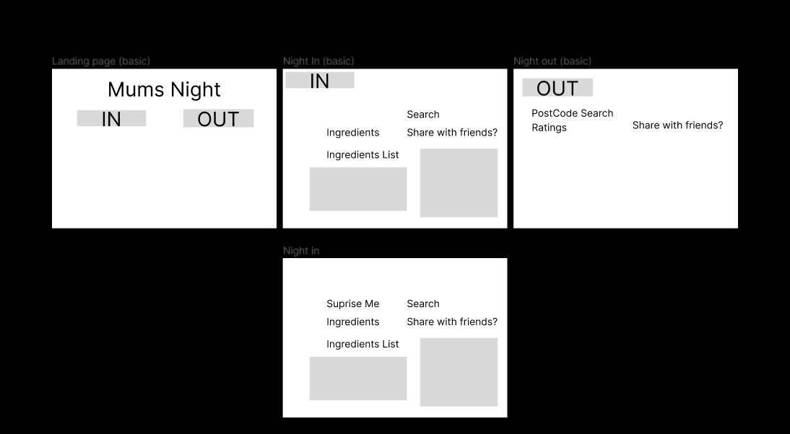
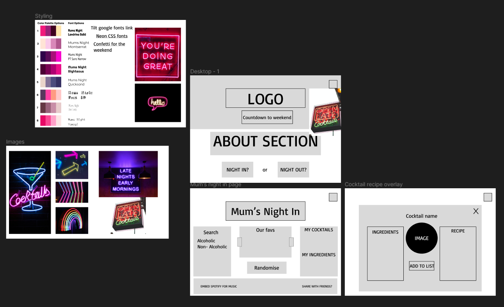
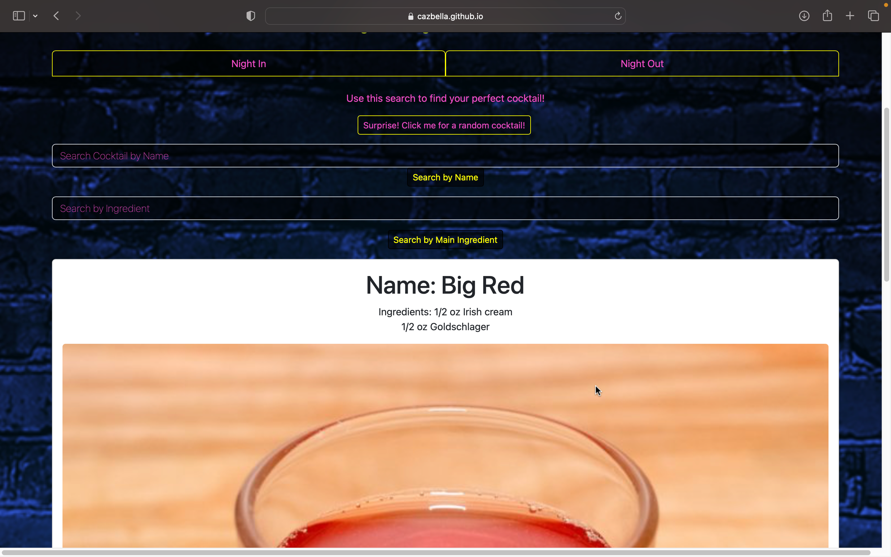
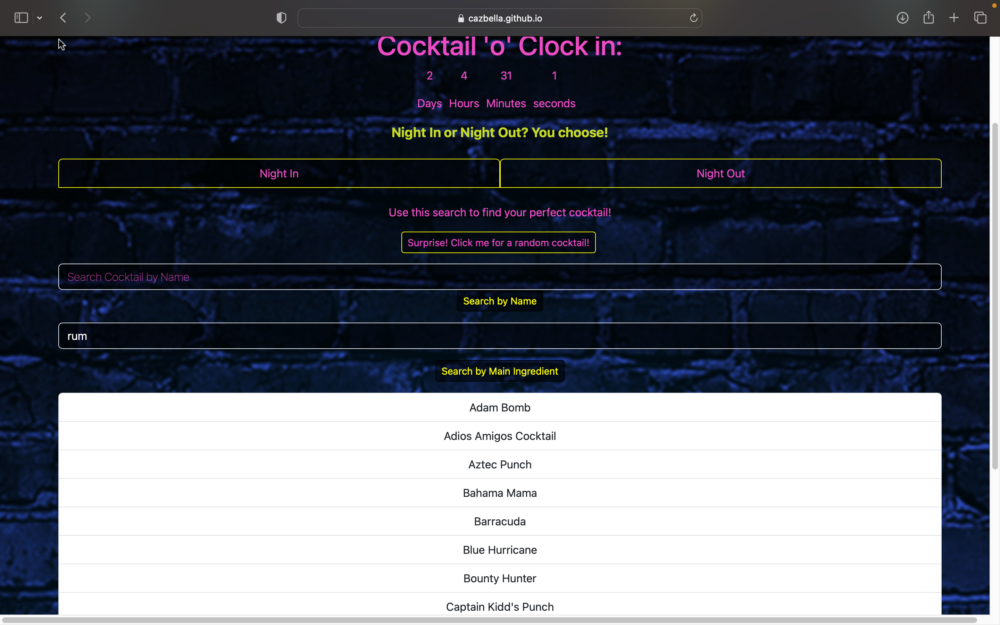

# Cocktail Nights a.k.a. Mums Night!
Where it all began... Our original user story...It’s Friday, you’ve been cleaning up baby sick ALL WEEK! You need a drink!  You want something new, not the same, boring can of lager. This website will give you lots of ideas for delicious cocktails to help you relax after a hard week of being a Mum! Don’t fancy making it yourself? Leave it to the pros and find a cocktail bar near you!

This was our original logo...

We decided to change our user story to include more of the people who would be watching the presentation!

It’s Friday, you’ve made it through the week! You may have suffered any of the following; annoying colleagues, oppressive bosses, pints of baby sick, or maybe just had a week that you need to leave behind! You need a drink! You want something new, not the same, boring can of lager. This website will give you lots of ideas for delicious cocktails to help you relax after a hard week of being you! Don’t fancy making it yourself? Leave it to the pros and find a cocktail bar near you!

https://cazbella.github.io/mums-night/

## Motivation
This application is born from 3 mums who were desperate for a relaxing weekend! We wanted to enjoy something different, either making a new drink at home or going somewhere new! We designed this application to search for cocktail recipes to make at home and cocktail bars near us!

The original ideas are shown in the wireframe below. 

Our first Wireframe shows our initial ideas and basic flow of our page

Our second Wireframe includes colour palettes and font options as well as image inspiration and another iteration of out layout. 

## Usage

Upon loading the application the user is faced with the following page;

Underneath the main banner is a countdown timer to Friday when the weekend begins!

There are 2 tabs, 'Night In' and 'Night Out'.

1. When a user lands on the page they will see the 'Night In' content. The user can click a button to get a surprise cocktail, as shown below, 

The card containing the cocktail shows the name, ingredients, measure, photograph and instructions to make the cocktail. 

When a user then scrolls to the bottom of the information they can save the information to favourites in the footer, as shown below. 

2. A user can also search for a cocktail by name, as shown below, 

3. The user can also search by ingredient and is then presented with a list of 10 cocktails that contain that ingredient, as shown below, 

4. When the user clicks a cocktail on the list, then are presented with a card as before containing the cocktail details. 

## Challenges

These are the challenges we faced

__Issue 1__
_____________________________

This issue was

__A Note about ...__
_____________________________

Although we 

# References 
reset css stylesheet
https://meyerweb.com/eric/tools/css/reset/

yelp developer docs
https://www.yelp.com/developers/v3/

Callback Functions Explained in 5 minutes
https://youtu.be/kz_vwAF4NHI?si=-c8Typf3oGpAE08v

URL SEARCH PARAMS
https://developer.mozilla.org/en-US/docs/Web/API/URLSearchParams

## Contributing

## License

[MIT](https://choosealicense.com/licenses/mit/)
